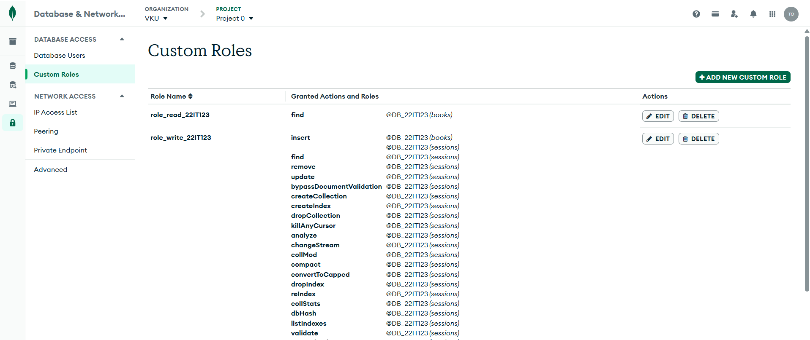
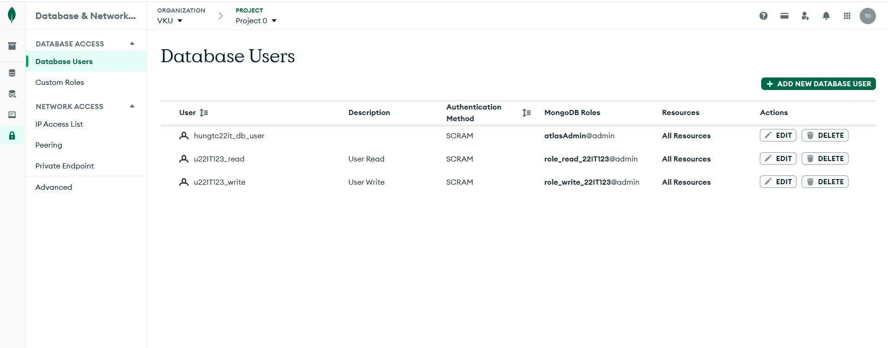
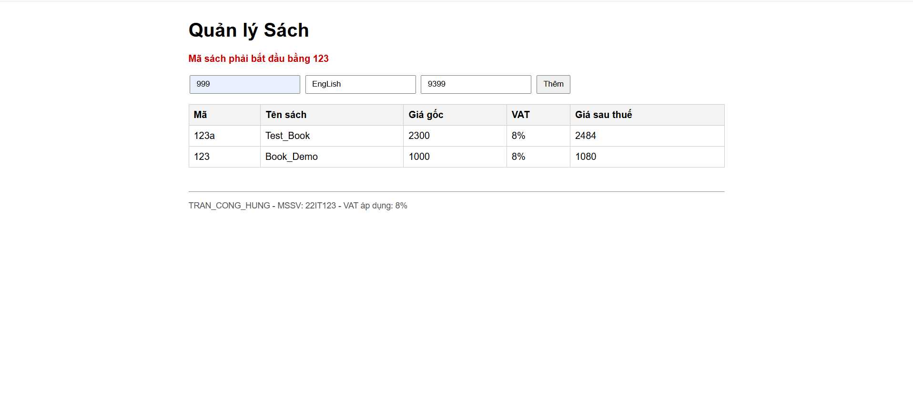
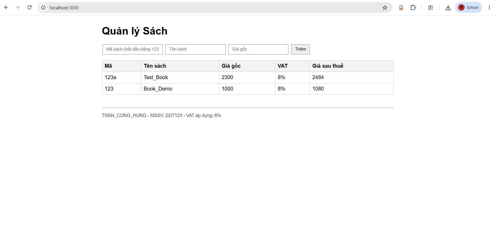

# Checklist bài kiểm tra giữa kì - Điện toán đám mây

**Đề tài:** Quản lý Sách trên Cloud (Node.js/Express + Handlebars + MongoDB Atlas + Render)
**Sinh viên:** Trần Công Hưng | **MSSV:** 22IT123 | **Lớp:** 22SE2
**VAT áp dụng:** (3 + 5)% = **8%** | **Tiền tố mã sách:** `123`

| Thông tin | Giá trị |
|---|---|
| Repo GitHub (Private) | https://github.com/conghungtran/Clound-Computering_exam |
| Database | `DB_22IT123` |

> Ký hiệu: `[x]` đã hoàn thành và có ảnh minh chứng, `[ ]` chưa hoàn thành hoặc chưa có ảnh.
> Ảnh minh chứng nằm trong thư mục `documents/`.

---

## 1. Kiến trúc bảo mật cơ sở dữ liệu Cloud (2.5đ)

- [x] Database `DB_22IT123` trên MongoDB Atlas, có collection `books`
- [x] Custom Role theo nguyên tắc đặc quyền tối thiểu
  - `role_read_22IT123`: chỉ `find` trên `books`
  - `role_write_22IT123`: `insert` trên `books`, và các quyền cho collection `sessions` (phục vụ lưu session)

  

- [x] 2 Database User độc lập gắn với MSSV: `u22IT123_read` và `u22IT123_write`, mỗi user chỉ gắn đúng 1 custom role

  

## 2. Logic Backend và kiến trúc Stateless (4.5đ)

- [x] Kết nối đồng thời 2 tài khoản (`db.js`): đọc đi qua `u22IT123_read`, ghi đi qua `u22IT123_write`
- [x] Bộ lọc mã sách: bắt buộc bắt đầu bằng `123`, sai thì từ chối

  

- [x] Giao diện Handlebars hiển thị danh sách sách, giá sau thuế (VAT 8%), footer có Họ tên, MSSV và mức VAT

  

- [ ] Session lưu tập trung trên MongoDB Atlas (`session.js`, collection `sessions`), không lưu trong RAM
  - Ảnh cần bổ sung: collection `sessions` trên Atlas, và `/visit` giữ bộ đếm sau khi restart server

## 3. Quản lý mã nguồn và kiểm soát DevOps (1.5đ)

- [x] `.gitignore` chặn `.env`, `node_modules/` và file rác; `.env` không có trong repo
- [ ] 2 nhánh tính năng `feature/database` và `feature/session`, gộp về `main` bằng `--no-ff`
  - Ảnh cần bổ sung: kết quả `git log --graph --oneline --all` hiện 2 merge node

## 4. Triển khai hệ thống thực tế (1.5đ)

- [ ] Repo GitHub ở chế độ Private, đã cấp quyền cho giảng viên (Settings, Collaborators)
- [ ] Ứng dụng chạy trực tuyến trên Render, chuỗi kết nối cấu hình qua Environment (`MONGO_READ_URI`, `MONGO_WRITE_URI`, `SESSION_SECRET`, `NODE_ENV`), không viết trong code
  - Ảnh cần bổ sung: màn hình Environment trên Render (che mật khẩu) và link ứng dụng chạy được

---

## Cấu trúc project

```
book-cloud/
├── documents/        # ảnh minh chứng
├── views/
│   ├── layouts/main.hbs
│   └── books.hbs
├── app.js
├── config.js
├── db.js
├── session.js
├── package.json
├── .env.example
└── .gitignore
```

## Chạy ở máy local

```bash
npm install
cp .env.example .env    # điền mật khẩu thật của 2 user
npm start               # http://localhost:3000
```
